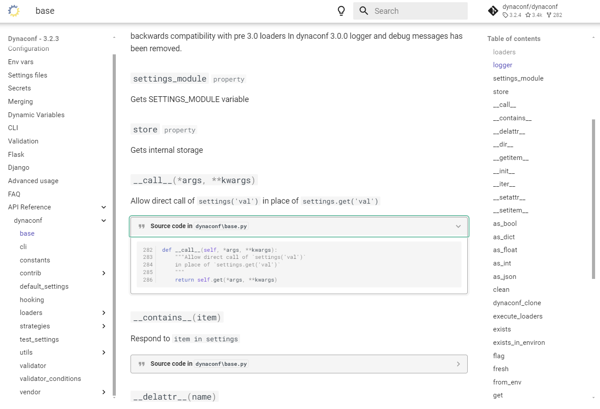
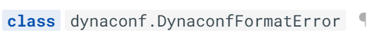
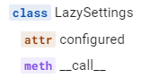
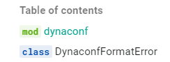

# Auto-generating package API with `mkdocstrings`

Whenever I land on a new Python package docs these days, the docs tend to be built with
[`mkdocs`][mkdocs] and the [`mkdocs-material`][mkdocs-material] theme, heralding a bit of a
departure from the era of the [Sphinx].

It's true, Sphinx still remains very popular and is endlessly extensible through its directives
feature and its many plugins, but there is something about the beauty of `mkdocs-material`, its ease
of deployment and its richness in features that makes it such a popular choice right now.

<!-- more -->

Not to forget the simplicity of writing content in markdown which is very widely understood.
All good reasons why I started this blog with `mkdocs-material`!

One thing that Sphinx does very well is autogenerating your project's API using the information
present in docstrings. This doesn't come out of the box with `mkdocs`, but can be enabled with the
plugin `mkdocstrings` which [has some great features](https://mkdocstrings.github.io/#features).

The [main usage](https://mkdocstrings.github.io/usage/) of `mkdocstrings` seems to be centred around
the concept of inline injection, but I wanted to test out their automatic API docs generation
feature which [they provide a recipe for here][API-gen].

## Setting up

So there's not too much too it - only 4 steps:

1. Add and install the docs dependencies

    ```toml title="pyproject.toml"
    [tool.poetry.group.docs.dependencies]
    mkdocs = "^1.5.3"
    mkdocs-material = "^9.5.9"
    mkdocstrings = {extras = ["python"], version = "^0.24.0"}
    mkdocs-gen-files = "^0.5.0"
    mkdocs-literate-nav = "^0.6.1"
    mkdocs-section-index = "^0.3.8"
    ```

2. Add these plugin details to `mkdocs.yml`

    ```yaml title="mkdocs.yml"
    plugins:
    - search
    - gen-files:
        scripts:
        - scripts/gen_ref_pages.py
    - literate-nav:
        nav_file: SUMMARY.md
    - section-index
    - mkdocstrings
    ```

3. Add the reference section to the navigation settings in `mkdocs.yml`
    ```yaml title="mkdocs.yml"
    nav:
    - Home: index.md
    ...
    - API Reference: reference/
    ```

4. Add the [`gen_ref_pages.py`][gen-ref-pages.py] script to the `scripts/` folder at the top level


## Trying it out

To test this out I created a [dummy package][autoref-demo-repo], and for a bit of fun I centred it
on a Gandalf class 🧙‍♂️.

<!-- ??? quote "The Gandalf Class"
    <script src="https://gist.github.com/mitches-got-glitches/3fad75f9ecdd1ab618b4357e47f05c0b.js"></script> -->

??? quote "The Gandalf Class"
    ```py
    --8<-- "https://raw.githubusercontent.com/mitches-got-glitches/mkdocstrings_autoref_demo/main/src/gandalf/main.py"
    ```

I devised a few rules around setting Gandalf's weapon and his mount. And I gave him two methods for
things that he absolutely loves to do:

* deny (because Gandalf loves telling you that you shall not do something)
* travel (because he gets about the map blimming fast)


I tried to use a variety of different techniques to see how they generated in the autodocs, such as
methods, properties and class methods.

I also created two classes with parent ABC `Mount` in the utils.py, one for ShadowFax and one for
the big eagle that comes to his aid.

??? quote "Gandalf's utils"
    ```py
    --8<-- "https://raw.githubusercontent.com/mitches-got-glitches/mkdocstrings_autoref_demo/main/src/gandalf/utils.py"
    ```

So now that we have our watertight Gandalf API, we can [see how the docs look once generated][gandalf-ref].


## Doing it for real

I noticed an [open issue](https://github.com/dynaconf/dynaconf/issues/997) on the Dynaconf GitHub
page which was tagged as a good first issue. They had migrated over to `mkdocs-material`
but they hadn't yet enabled any autogeneration of their API docs. It was present [on their old
docs](https://dynaconf.readthedocs.io/en/docs_223/reference/dynaconf.html#) but [not on their new
docs](https://www.dynaconf.com/).

What they needed was for `mkdocstrings` to be setup and some tuning to present their API reference
as they wanted. I'm not a frequent contributor to open-source but this seemed simple enough that I
could do it and also a decent opportunity to learn something, so I started prepping the [demo
run](#testing-it-out) and offered to give it a go.

Before the maintainers could reply to my offer, I went gun-ho and made a first attempt to build the
API reference using the same automated recipe that I'd attempted on my dummy API. However, there was
a slight difference in the project structure of the `dynaconf` project that meant a few changes were
needed; the [`gen_ref_pages.py`][gen-ref-pages.py] script assumes the following structure:

```txt
.
└── src/
    └── dynaconf/
        └── __init__.py
```

... but `dyanconf` doesn't have the `src/` folder:

```txt
.
└── dynaconf/
    └── __init__.py
```

<!-- ??? info "These lines of code will definitely be affected."
    ```py title="gen_ref_pages.py" linenums="1" hl_lines="8-13"
    --8<-- "gen_ref_pages.py"
    ``` -->

This requires the following changes to the [`gen_ref_pages.py`][gen-ref-pages.py] script:

```py title="gen_ref_pages.py" linenums="1" hl_lines="8-9 11-14 34"
--8<-- "gen_ref_pages_not_src.py"
```

  1. Define project `root` and `src` as different variables.
  2. Glob the py files from `src`
  3. Define `module_path` and `doc_path` relative to `root`.
  4. Resolve relative paths - see warning below.
  5. Resolve relative paths - see warning below.

!!! warning
    If the relative paths were not resolved, the `mkdocs-gen-files` plugin seemed to place the files
    outside of the project folder. This caused the `mkdocs-git-revision-date-plugin` used by
    `dynaconf` to throw git errors.

These changes allowed the full API reference to be built successfully, and it looked like this in
the docs:



### Simplifying it

After going gun-ho and generating the full API for every single module, I had some feedback from the
maintainers that it was preferred not to have all these modules generated as many of them do not
contain public facing API. Time to scale it back.

One thing I noticed was that at the top `dynaconf` level in the reference, it actually
auto-generated everything that was present in the top level API that was defined in the
`__init__.py`:

```py title="dynaconf/__init__.py"
--8<-- "https://raw.githubusercontent.com/dynaconf/dynaconf/0390393c27a7ef27104bbda2426b3382dcc7fb9f/dynaconf/__init__.py:30:42"
```

!!! note
    It only includes what has been set in the `__all__` property, not everything that is imported
    into `__init__.py`.

With that in mind, we can potentially do away with the recursive generation of sub-modules since in
this case we are only interested in exposing the top level API. And therefore the only two steps
needed are:

1. Create a new markdown file in the docs with the following:
    ```md title="docs/api.py"
    # dyanconf API
    ::: dynaconf
    ```
2. And add the section to the navigation in `mkdocs.yml`
    ```yaml title="mkdocs.yml"
    nav:
    - Home: index.md
    ...
    - Reference:
        - API: api.md
    ```

We end up with a much more simple solution which does the job well and shows off the awesome power
of the `mkdocstrings` plugin!

To get the API docs looking super nice, there's a couple of extra settings that were added in this
case:

```yaml title="mkdocs.yml"
plugins:
  - mkdocstrings:
      handlers:
        python:
          options:
            show_symbol_type_heading: true # (1)!
            show_symbol_type_toc: true # (2)!
            show_root_toc_entry: false # (3)!
            show_object_full_path: true # (4)!
```

1. Adds the `class` symbol in front of the object:
   
2. Adds symbols to the table of contents:
   
3. Removes the module from the top of the toc - it doesn't correspond to anything on the page:
   
4. Adds the full dot path to the object:
   

Further CSS customisation was added for the Material theme, [as recommended in the mkdocstrings
docs][material-mkdocstrings-style]. I put the CSS in `docs/stylesheets/mkdocstrings.css` and added
the following to `mkdocs.yml`:

```yaml title="mkdocs.yml"
extra_css:
  - stylesheets/mkdocstrings.css
```

With that all done [my PR was approved and merged](https://github.com/dynaconf/dynaconf/pull/1058)
🦾 and the resulting docs can [be previewed here](https://deploy-preview-1058--dynaconf.netlify.app/api/).

There are a few improvements to be made to the docstrings themselves but that's for another time.

Anyway, I hope you enjoyed my first post and I hope you have the confidence to go and give
`mdocstrings` a go in your own projects.


[mkdocs]: https://www.mkdocs.org/
[mkdocstrings]: https://mkdocstrings.github.io/
[mkdocs-material]: https://squidfunk.github.io/mkdocs-material/
[Sphinx]: https://www.sphinx-doc.org/
[API-gen]: https://mkdocstrings.github.io/recipes/#automatic-code-reference-pages
[autoref-demo-repo]: https://github.com/mitches-got-glitches/mkdocstrings_autoref_demo
[gandalf-ref]: https://mitches-got-glitches.github.io/mkdocstrings_autoref_demo/reference/gandalf/
[gen-ref-pages.py]: https://github.com/mitches-got-glitches/mkdocstrings_autoref_demo/blob/523a6ef7b63a3161c5ef4fa9ac1ffd4ea3104925/scripts/gen_ref_pages.py
[material-mkdocstrings-style]: https://mkdocstrings.github.io/python/usage/customization/#material