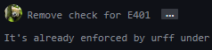
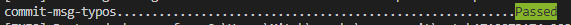
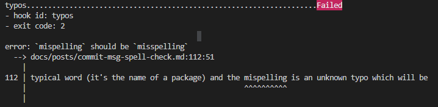

# Spell check `git` commit messages with this `pre-commit` hook

Us developers are often in a rush to get our commits up and nobody wants to meticulously check for
spelling errors each time. However, it can be annoying when you check your commits on GitHub to see
one.

<figure markdown="span">
  
  <figcaption>Argggh 😫</figcaption>
</figure>

Sure, we can live with a spelling error here and there, especially if we squash commit messages when
we merge. But if there's a simple way to fix them, then why not?

<!-- more -->

[`typos`](https://github.com/crate-ci/typos) is a cracking spell checking tool that has very low
false positives and is written in Rust, meaning it can make light work of even the largest of
monorepos.

This isn't just a tool to check your commit messages - *no no* - this will spell check your entire
project in lightning quick time.

I had a go at introducing it in an existing project, `dynaconf`, and [you can see for
yourself][typos-PR] how well it picked up spelling errors. And I have of course [just
added][typos-this-blog] it as a `pre-commit` check for this blog too to keep my posts clear of
any dreaded spelling errors.

### Tip Details

To get it working for your projects, do the following:

<div class="annotate" markdown>
1. Install pre-commit.
   ```console
   pip install pre-commit
   ```
2. Add the following hooks to your `.pre-commit-config.yaml`, focusing on the highlighting lines if
   you only want to add spell check for commit messages (I recommend both).

   ```yaml linenums="1" title=".pre-commit-config.yaml" hl_lines="9-11"
   --8<-- "https://raw.githubusercontent.com/mitches-got-glitches/developer_blog/8787ca266c9651c1df7a1379d24eae64b6a697f9/.pre-commit-config.yaml"
   ```
3. Install the hooks. (1)
   ```console
   pre-commit install
   ```

</div>

1.  You should see:

    ```txt hl_lines="2"
    pre-commit installed at .git\hooks\pre-commit
    pre-commit installed at .git\hooks\commit-msg
    ```


!!! note
    The `commit-msg-typos` hook above will fix any typos by default rather than exiting with a zero
    error code. If you'd rather, you can make the commit fail and fix the errors yourself. Just
    repeat the option `args: []` which will turn off automatic fixing.

    If you typed your commit message out in an editor like `vim`, it may seem like you've lost your
    message when your pre-commit check fails. But don't stress, git stores it in the file
    `.git/COMMIT_EDITMSG`. To get back to your message and edit your mistakes, use the following
    command:

    ```bash
    git commit --edit --file=.git/COMMIT_EDITMSG
    ```

    Or register as an alias of your choice, like this example:

    ```bash
    git config --global alias.fix-commit 'commit --edit --file=.git/COMMIT_EDITMSG'
    ```

    then...

    ```bash
    git fix-commit
    ```

### Final Remarks

With this all setup, you should have a new pre-commit hook, `commit-msg-typos` that runs after you
have written your message.

<figure markdown="span">

</figure>

The default behaviour where `typos` fixes your spelling errors will mean that this hook will pass
almost every time - it will only fail if there are multiple possible corrections as `typos` won't
know which to pick. In this case, or if you have it set to fail on spelling errors so you can
correct yourself, take heed of the note above for an additional tip.

And finally, as good as `typos` is, it will still let some errors pass where it is unsure. For
example, the error in the intro example wouldn't actually fail or fix because "ruff" is not a
typical word (it's the name of a package) and the misspelling is an unknown typo which will be
ignored. This is because of the importance `typos` places around low false positives ([see more on
the design][typos-design]), so do still take caution with your spelling.

<figure markdown="span">
  
  <figcaption>And an ironic typo to finish...</figcaption>
</figure>

Have fun catching those typos!

[typos-PR]: https://github.com/dynaconf/dynaconf/pull/1063
[typos-this-blog]: https://github.com/mitches-got-glitches/developer_blog/blob/8787ca266c9651c1df7a1379d24eae64b6a697f9/.pre-commit-config.yaml
[typos-design]: https://github.com/crate-ci/typos/blob/master/docs/design.md
