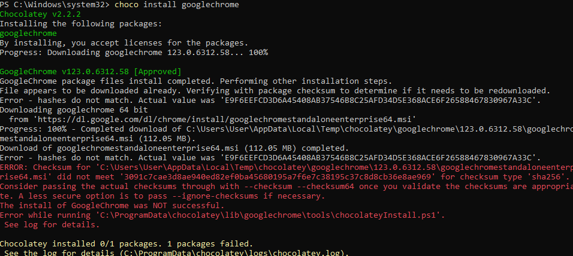

# Chocolatey vs. Scoop vs Winget - which Windows package manager to use?

It didn't seem like that long ago that there wasn't much choice when it came to package managers on
Windows, but as it finally matures a bit there are actually a few to choose from. Knowing the
differences between them and which one to choose can be a little overwhelming at first, so in the
process of trying to justify my own choices I thought I would write up this article to give a bit
of background, explain the options available and some of the key differences between them.

<!-- more -->

## Chocolatey
[Chocolatey][choco] has been around for a while, (since 2011 apparently), and has been my
go to for a while. Chocolatey usually requires you to run installs in a shell with admin privileges,
and when it comes to installing community packages, this means that you are often running a
Powershell script. This comes with a few security concerns because you are running a community
submitted script with admin privileges. Chocolatey even have this to say about their own install
script:

> Please inspect
> [https://community.chocolatey.org/install.ps1](https://community.chocolatey.org/install.ps1) prior
> to running any of these scripts to ensure safety. We already know it's safe, but you should verify
> the security and contents of any script from the internet you are not familiar with. All of these
> scripts download a remote PowerShell script and execute it on your machine. We take security very
> seriously.

*You should verify the contents of any script from the internet you are not familiar with...* OK, I
appreciate that this is good advice and all but really? It's a bit like asking me to read the User
Agreement (I would link to Limmy's sketch if I could find it). Life's too short and I'm a naturally
trusting person (read: too naïve for the internet).

Still, I do take some precautions and employ a little common sense, and I want to be able to trust
my package manager without reading every darn script.

In 2014, Keivan Beigi (the developer of another Windows package manager: AppGet) wrote this
critique: [Why Chocolatey is Broken Beyond Any Hope](https://keivan.io/why-chocolatey-is-broken/).
He also mentions security, but it does seem like Chocolatey have stepped things up since then.
[Their page on security is pretty extensive][choco-security], in fact they have this to say:

> Some folks may state that Chocolatey is insecure. That is based on older information and is
> incorrect to be stated in that way. Feel free to correct the person with "You mean Chocolatey used
> to be insecure, you might want to catch up with the last 3+ years."

> It is correct that there were some major security concerns. However, all known concerns have been
> corrected and/or have a plan to be resolved (e.g. package signing).

So it seems as if the team behind Chocolatey have re-doubled their efforts to refute the security
concerns that people used to have. As for the other concerns raised by Keivan, I'm not in a position
to say if they've been solved, but Chocolatey seems to still be going strong.

One demonstration of the security features at work is when I tried to install Google Chrome just
now - the checksum didn't match.



So what do I do now...? I don't know. Guess I stick with Firefox.

[choco]: https://chocolatey.org/
[choco-security]: https://docs.chocolatey.org/en-us/information/security#overall

## Winget

`winget` is Microsoft's own package manager for Windows which sources from the Microsoft Store and
the [Windows Package Manager Community Repository](https://github.com/microsoft/winget-pkgs). It's
[first commit][winget-first-commit] on the [open-source CLI][winget-github] was at the tail end of
2019, and [they credit][winget-credit] Keivan Beigi for AppGet which *"helped us on the initial
project direction"*. However, if you read [Keivan's side of the story][the-day-appget-died] it seems
like Microsoft pulled some pretty questionable tactics when engaging with him and how they used his
ideas.

Alas, Keivan seems to accept the silver linings, that Windows finally has a native package
manager which is built on [the foundation of his ideas][appget-features], even if they did treat him
like shit. They [added the credit][credit-commit] a couple of weeks after Keivan's article in May
2020... better late than never I suppose.

So despite it's potentially villainous origin story, should you use `winget`? It's great that it's
native, so for my case I've tended to use it for Microsoft native products such as OneDrive and
OneNote. There doesn't seem to be a good browser based search for the community packages yet. It
seems to work fine but I don't have that much more to say for it currently!

[winget-credit]: https://github.com/microsoft/winget-cli/tree/master?tab=readme-ov-file#credit
[winget-github]: https://github.com/microsoft/winget-cli
[winget-first-commit]: https://github.com/microsoft/winget-cli/commit/b1278ab4e65b9aa8964d6028690b34b08b327237
[the-day-appget-died]: https://keivan.io/the-day-appget-died/
[appget-features]: https://keivan.io/appget-what-chocolatey-wasnt/
[credit-commit]: https://github.com/microsoft/winget-cli/commit/ed545f996acd36e9b4b277949abc7f62e259ad68

## Scoop

`scoop` is the final command line installer for Windows that I want to mention, and it does things a
little differently to the other two. It takes its inspiration from [Homebrew](https://brew.sh/)
(Mac/Linux) and aims to be:

> very scriptable, so you can run repeatable setups to get your environment just the way you like,
> e.g.:
> ```bash
> scoop install sudo
> sudo scoop install 7zip git openssh --global
> scoop install aria2 curl grep sed less touch
> scoop install python ruby go perl
> ```

They [list the features that make it different to Chocolatey and Winget][scoop-feature-comparison],
the main one's for me being:

* Install don't require admin rights, since they install just for your user account in `~/scoop/` by
  default.
* It doesn't pollute your path, instead putting shims to installed programs in a single directory
  and making sure that is added to the path (this seems similar to how Hmebrew does it).

It also has simpler packaging - on the GitHub README it says:

> Scoop is an alternative to building an installer (e.g. MSI or InnoSetup) — you just need to zip
> your program and provide a JSON manifest that describes how to install it.

So these amount to quite a big difference from Chocolatey and Winget which will usually search for
the MSI installer files and use that to install in the default locations for apps on Windows
(`C:/ProgramData/...`). This requires admin rights which often need to be confirmed with UAC popups
if not running with admin privileges.

In terms of when to use it, [scoop says that][scoop-types-of-app]:

> The apps that install best with Scoop are commonly called "portable" apps: i.e. compressed program
> files that run stand-alone when extracted and don't have side-effects like changing the registry
> or putting files outside the program directory.

I've also seen this:

> Scoop focuses on open-source, command-line developer tools. The [scoop-extras
> bucket][scoop-extras] is for non developer tools.

And [this criteria for including apps in the main bucket][main-bucket-criteria].

I think I encountered the side effects case when I installed VS Code via scoop. First I had to add
the extras bucket since VS Code has a GUI:

```bash
scoop bucket add extras
```

Then when I installed VS Code, it gave me a couple of commands to add keys to registry:

```bash
scoop install extras/vscode
reg import "C:\Users\User\scoop\apps\vscode\current\install-context.reg"
reg import "C:\Users\User\scoop\apps\vscode\current\install-associations.reg"
```

But all was still simple enough and easily scripted.

## Conclusion

So scoop, I like scoop. Possible the catchiest of the three in terms of naming, but also the most
attractive to me as a developer as it looks and quacks like some of the Linux package managers that
I like using. I also like the portable nature of it. If I'm doing Windows developery stuff then it
will be my first choice. If you're still unsure about it, see [this summary page][why-scoop] on why
you might use scoop.

I'll still install `choco` and have `winget` as back ups. `winget` I've used for installing
Microsoft Apps. Some apps just aren't in scoop, such as Docker Desktop, so in that case I've fallen
back on `choco`.

---

*Do you have different preferences? Feel free to let me know in the comments below.*

*Also, I'm always learning and may get some things a bit wrong, please point that out in the comments
too - thanks!*

*[UAC]: User Account Control
[scoop-feature-comparison]: https://github.com/ScoopInstaller/Scoop/wiki/Chocolatey-and-Winget-Comparison
[scoop-types-of-app]: https://github.com/ScoopInstaller/Scoop?tab=readme-ov-file#what-sort-of-apps-can-scoop-install
[scoop-extras]: https://github.com/ScoopInstaller/Extras
[main-bucket-criteria]: https://github.com/ScoopInstaller/Scoop/wiki/Criteria-for-including-apps-in-the-main-bucket
[why-scoop]: https://github.com/ScoopInstaller/Scoop/wiki/So-What#but-i-already-use-x-why-should-i-use-scoop
