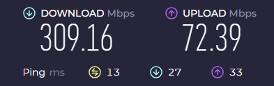
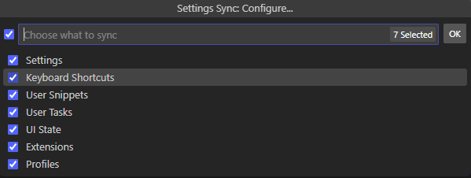
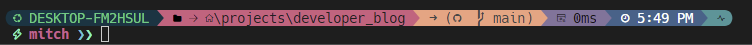

# Setting up a new Windows laptop for Python development

## The Backstory

I've been doing a bit more development on my personal laptop lately and I was starting to brush up
against the limits of my hardware. I have a Thinkpad X270, and although it comes with the renowned
keyboard and a sturdy (not quite) bullet-proof chassis, I was starting to question the other parts
of the spec... 8GB of RAM, an Intel i5-62000U processor and only 155GB of usable disk... I quickly
ran out of space after setting up Windows Subsystem for Linux, a few versions of Python and some
virtual environments.

Fair enough, I had a bit of bloat that I could slim down but I didn't want to have to make this a
regular occurrence. Also, being a bit of a tab whore I was starting to experience a bit of slowness
as I switched contexts between VS Code and my browser. Frankly, I could do with an upgrade. And
although it had absolutely zero influence over this decision I was also experiencing a few ping
issues when playing Age of Empires II: Definitive Edition online despite good ping and speeds on the
internet tests... nope, no sway at all.

<!-- more -->

<figure markdown="span">
  
  <figcaption>Wireless speeds... musn't grumble</figcaption>
</figure>

Although I was tempted by some new shiny models, I didn't want to break the bank. And although Macs
are touted for development, I will forever be a Windows child - I just can't seem to break
through my frustrations with the Apple UX. Plus, with Windows Subsystem for Linux now a thing and
Windows 11 actually looking quite sleek I didn't feel the need to finally get over my Macphobia. If
I had the money, (I think it would be funny...🎵), I would have probably went for a souped up Dell
XPS 15 after seeing [some pretty solid reviews][dell-xps-15-review-2023]. It seemed to offer good
performance for programming and creative workloads while also having a decent graphics card.

As it happens, I spotted a refurbed model of the XPS 15 (9570) on ebay which was packing a 1TB SSD
and 32GB of RAM for just shy of £500. This model [seemed to review pretty
well][dell-xps-15-review-2018] at the time, and I was happy with this spec at the price point so I
decided to purchase. I'm not very tuned in to the world of CPU processors, but it came with an
i7-8750H which, while not world-leading, seems [to offer a considerable improvement][cpu-benchmark]
over the i5-62000U of my Thinkpad. And on top of that it came equipped with a Nvidia GTX 1050Ti 4GB
graphics card, so if Age of Empires did happen to fire up then I should have fewer online teammates
complaining about my lag...

[dell-xps-15-review-2023]: https://uk.pcmag.com/laptops/147048/dell-xps-15-9530-2023
[dell-xps-15-review-2018]: https://www.expertreviews.co.uk/dell/1407577/dell-xps-15-9570-review-2018
[cpu-benchmark]: https://cpu.userbenchmark.com/Compare/Intel-Core-i7-8750H-vs-Intel-Core-i5-6200U/m470418vsm36796

## Setup Goals

So it arrived and on unboxing first thoughts were it's a bit chunkier, but then I'm intending to use
it mainly as a desktop, and I'll probably hang on to the Thinkpad for a more portable work machine
anyway.

We're getting onto why I actually wanted to write this post, and that's to run through my
development setup on a new Windows machine, mainly so that when I have to go through this again I
have a good point to start from, but also to hopefully demonstrate some good practices for creating
a productive development experience on Windows.

Let me run through a few of my main goals:

1. **Using WSL2 for my main development environment**

    Linux is probably the most common build environment when building applications, and as such, it
    makes sense to develop in Linux if we can. [Windows Subsystem for Linux][what-is-wsl] offers an
    awesome way to run a Linux environment on Windows without a virtual machine. It's pretty simple
    to do and it automatically mounts your Windows drive. The WSL extension for VS Code is going to
    provide a seamless development experience between the Windows and Linux environments.

2. **Using virtual environments where possible to keep my base installs unpolluted**

    This should make libraries/tools easy to purge or upgrade and to prevent any base installations
    from getting corrupted. I also want to keep project environments separate, and only install what
    I need to with as few duplicate installs as necessary.

    Two great tools for this in Python are [`pyenv`][pyenv], which allows for easy installation and
    switching between different Python versions, and [`pipx`][pipx], which installs CLI tools in
    their own isolated virtual environments, puts all the shims in one place and adds this location
    to your path so you can use these tools anywhere.

3. **Using the command-line and package managers**

    The aim is to automate much of this in the future by putting a bunch of commands into a script,
    so using the command-line is a must. I also want to make use of some useful package managers:

    * [chocolatey](https://chocolatey.org/) (`choco`) / [scoop](https://scoop.sh/) / `winget` for
      Windows
    * `apt` for Linux (Debian/Ubuntu) and also [Homebrew](https://brew.sh/) (`brew`) (yes it works
      on Linux too)

4. **Making my config dotfiles portable**

    As developers, over time we gather a considerable amount of configurations that once we get used
    to it becomes really difficult to live without. I want a way to make these easily portable to
    new machines so that even if I'm SSH-ing into a machine on the cloud I can get the development
    environment that's going to enable me to be most productive.

 Anyway, enough goal-setting, let's get cracking...

[what-is-wsl]: https://learn.microsoft.com/en-us/windows/wsl/about#what-is-wsl-2

## The Setup

### Installing WSL

First on my list is installing WSL. This can take a few hours so it's best to get started with
early. Open Powershell with admin privileges and type in the following command:

```ps
wsl --install
```

That easy! The default OS installed for me was Ubuntu 22.04. Leave that to brew while we move onto
some of our Windows installs.

### Setting up on Windows

While writing this guide (mostly to myself), I ended up diving a bit into Windows package managers
and which would be the most suitable. I've spun this out into [a separate
post](windows-installer-comparison.md) so that I can keep this page focused on actual installation
steps. But my conclusions were:

* use `scoop` for any Windows dev tools and a first port of call for other apps
* use `winget` for Microsoft products e.g. OneDrive, OneNote, etc.
* use `choco` as a back up for apps that aren't available in `scoop` e.g. Docker Desktop

So here we go on the Windows steps:

#### Updating Powershell to latest version

In Powershell with admin privileges:

```ps
winget install --id Microsoft.Powershell --source winget
```

#### Install Microsoft Apps with `winget`

In Powershell with admin privileges:

```ps
winget install Microsoft.OneDrive --accept-source-agreements --accept-package-agreements
winget install onenote --accept-source-agreements --accept-package-agreements
```

!!! note

    Adding the arguments `--accept-source-agreements --accept-package-agreements` results in less
    confirmations needed in the shell. Use if you're happy with it.

#### Installing Chocolatey
In Powershell with admin privileges:

```ps
Set-ExecutionPolicy AllSigned; [System.Net.ServicePointManager]::SecurityProtocol = [System.Net.ServicePointManager]::SecurityProtocol -bor 3072; iex ((New-Object System.Net.WebClient).DownloadString('https://community.chocolatey.org/install.ps1'))
```

Confirm the prompts as necessary (trying to figure out a way to skip these temporarily). You should
now have Chocolatey installed, you can check by running `choco` from the command line.

!!! Warning

    The [install guide](https://chocolatey.org/install) says to inspect their `install.ps1` script
    before running, even though they take security seriously. Personally, I'm happy to go ahead with
    it and I'm not quite sure what I'm looking for anyway.

#### Installing `scoop`

In the `scoop` docs, it says to install from a Powershell terminal with the following:

```ps
Set-ExecutionPolicy -ExecutionPolicy RemoteSigned -Scope CurrentUser
Invoke-RestMethod -Uri https://get.scoop.sh | Invoke-Expression
```

However, I was getting a few issues with the execution policy - this seemed to work instead:

```ps
Set-ExecutionPolicy -ExecutionPolicy RemoteSigned -Scope CurrentUser
[Net.ServicePointManager]::SecurityProtocol = [Net.SecurityProtocolType]::Tls12 -bor [Net.SecurityProtocolType]::Tls11 -bor [Net.SecurityProtocolType]::Tls
$AllProtocols = [System.Net.SecurityProtocolType]'Ssl3,Tls,Tls11,Tls12'
[System.Net.ServicePointManager]::SecurityProtocol = $AllProtocols

irm get.scoop.sh | iex
```

This issues may be down to the version of Powershell I was on when initially installing `scoop` but
this remains uninvestigated - just need something that works.

#### Installing some apps with scoop

I just wanted to touch briefly on a few apps installed here.

Particularly for develepment I'm installing:

* `git` as my version control system
* `pyenv` so that I can install multiple Python versions in isolated environments and easily switch
  between them. `scoop` will install [`pyenv-win`][pyenv-win] since it is an installer for Windows.
* VS Code as my main IDE
* [Oh My Posh](https://ohmyposh.dev/) which offers nice prompt customisation.

Installing a couple of chat tools:

* [Slack](https://slack.com/intl/en-gb): some developer communities are on here.
* [Element](https://element.io/): same here - I've been communicating with the `dyanconf`
  maintainers here recently on some recent contributions.

And then I've just got Firefox as my browser, [Obsidian](https://obsidian.md/) which is a
note-taking app I am experimenting with a little. And Steam, because... well...

In any shell (doesn't need to be admin):

```bash
scoop update
scoop install git
scoop install pyenv
scoop install https://github.com/JanDeDobbeleer/oh-my-posh/releases/latest/download/oh-my-posh.json
scoop bucket add extras
scoop install vscode
reg import "C:\Users\User\scoop\apps\vscode\current\install-context.reg"
reg import "C:\Users\User\scoop\apps\vscode\current\install-associations.reg"
# I think the following 3 are in extras too, since they have GUIs.
scoop install screentogif
scoop install obsidian
scoop install element
scoop install slack
scoop install firefox
scoop bucket add games
scoop install steam
```

*[WSL]: Windows Subsystem for Linux
*[IDE]: Integrated Development Environment
*[OS]: Operating System
*[VS Code]: Visual Studio Code

#### Installing some apps with Chocolatey

There were a couple of apps that I struggled to install via `scoop`:

* [Docker Desktop][docker-desktop]: this is another developer tool for pulling and running
  containers, which happens to integrate very nicely with WSL.
* Discord: another chat app with developer communities, plus I use this to chat to my rage buddies.

You can install `docker` with scoop since it's just a CLI tool, but I wanted the Desktop GUI too.
For some reason it's not in the extras bucket but that's fine, it's why I have `choco` as backup.

Discord is available on `scoop`, but for some reason when I installed it via scoop Windows Defender
seemed to think it was a trojan. Sounds like I should be panicking huh? But a quick search seemed to
identify it as a known false flag - panic over?. Anyway, I just decided to use `choco` for this
rather than investigate further.

In Powershell with admin privileges:

```ps
choco install docker-desktop
choco install discord
```

!!! note
    If you don't want to confirm Y/N for each install, you can switch this off in choco global
    config with `choco feature enable -n=allowGlobalConfirmation`.

#### Installing Python

As noted in my setup goals the plan is to have WSL as my main development environment, but it will
still be useful to have at least one version of Python installed on the Windows path. I'll use
`pyenv` to install it.

In any shell (doesn't need to be admin):

```bash
pyenv update # (2)!
# Install the latest Python version
latest_py=$(pyenv install --list | grep -v '[a-z]' | tail -1) # (1)!
pyenv install $latest_py
pyenv global $latest_py # (3)!
```

1. This will grab the latest stable Python release.
2. Make sure pyenv is up-to-date with current versions.
3. Once installed we'll set this version as the global default.

#### Setting up VS Code

This is quite easy with VS Code's [settings sync feature][vscode-settings-sync] which I'd switched
on and linked to my GitHub account on my old PC. All I had to do was log in and all of my
configurations, extensions and keybindings were ported like magic.



This guide is already getting quite long so I won't get into the specifics of my VS Code setup just
yet, maybe another time...

[choco]: https://chocolatey.org/
[pyenv]: https://github.com/pyenv/pyenv
[pyenv-win]: https://github.com/pyenv-win/pyenv-win
[pipx]: https://pipx.pypa.io/stable/
[docker-desktop]: https://www.docker.com/products/docker-desktop/
[vscode-settings-sync]: https://code.visualstudio.com/docs/editor/settings-sync

### Setting up on Linux (WSL)

I've put up [a separate post covering how I've setup my WSL development environment in a portable
way](reproducible-linux-env.md). It's definitely worth checking out!

### Extras

#### Make sure Docker Desktop configured to WSL

Make sure this setting is checked within Docker Desktop to use with WSL. This should make the Docker
CLI available in WSL while Docker Desktop is up and running.


#### Custom terminal prompts with [Oh-My-Posh][oh-my-posh]

Oh My Posh brings a nice pop of colour to the terminal with a variety of themes to choose from.
Check out all of [the fully customisable themes here](https://ohmyposh.dev/docs/themes).

```ps title="Installing with scoop..."
scoop install https://github.com/JanDeDobbeleer/oh-my-posh/releases/latest/download/oh-my-posh.json
$env:Path += ";C:\Users\user\AppData\Local\Programs\oh-my-posh\bin"
```

Many of the prompt themes make use of iconography which requires you to have a [Nerd
Font][nerd-fonts] installed. Oh My Posh provides a nice tool to install the one you want:

```bash
oh-my-posh font install FiraCode
```

Because I want to [configure][font-config] the Nerd Fonts for Windows Terminal (which WSL launches
in on Windows 11) and Visual Studio Code, I think I need the fonts installed on Windows rather than
Linux. I installed in both though just to be sure:

```bash
oh-my-posh font install Hack
```

I had a bit of trouble configuring the VS Code font for a while, I think because I didn't have "Mono"
in the font name. Anyway, here's the two settings that I've configured for the 'Hack' Nerd Font:

```json title="Windows Terminal settings.json"
    "profiles":
    {
        "defaults": {
            "font":
            {
                "face": "Hack Nerd Font Mono"
            }
        },
        ...
    }
```

```json title="VS Code settings.json"
  "terminal.integrated.fontFamily": "'Hack Nerd Font Mono'",
```

And with the font configured (only for nushell currently):



I've [configured for Monty's theme here][nu-font-config]. You can also check out my other nu config
in the `custom.nu` file there if you're interested.


[oh-my-posh]: https://ohmyposh.dev/
[nerd-fonts]: https://www.nerdfonts.com/
[font-config]: https://ohmyposh.dev/docs/installation/fonts#configuration
[nu-font-config]: https://github.com/mitches-got-glitches/dotfiles/blob/main/nu/.config/nushell/env.nu#L99-L101

## Wrap Up

So there you have it, my setup for Python development and beyond on my new Windows 11 laptop. It's
been a bit of a beast doing all of it and capturing in writing but I hope you (and my future self)
gets something useful from it.

I may come back and make some new additions to this from time-to-time as I integrate more into my
workflow, but this is more than enough for now.

---

*Which parts of this guide will you try and integrate into your own environment?*
